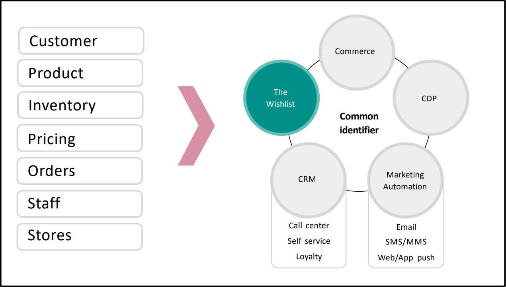
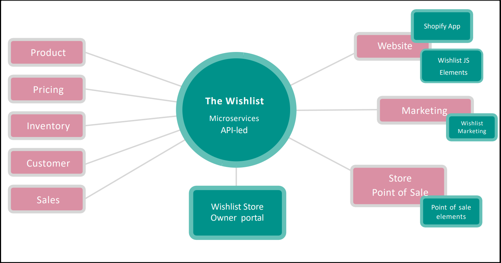

# Getting started with The Wishlist #
## Developers' guide ##

### What is The Wishlist ###

The Wishlist platform is a microservices-based, API-enabled engine that empowers retailers to understand and manage lists of products that their customers want to purchase ("wishlists").

Retailers integrate The Wishlist platform with their website, and optionally to their store point of sale, so that customers can easily save items they are interested in, and so that they can market more effectively to their customers.

**Automated notifications** can be configured and sent to customers when products are low in stock, back in stock, on sale, or added to a wishlist.   Reminders can also be regularly sent to customers.
**On-demand notifications** are retailer-triggered alerts that can be configured to notify customers about items that are coming soon, or that have been restocked.

A dashboard and set of reports available through a reporting console help retailers understand customer demand, popular products and wishlist conversions.

The Wishlist also integrates to **Point Of Sale (POS)** in-store. This makes it an ideal way for retailers to bridge online and offline services.

The Wishlist integrates with websites, store POS, existing marketing and ERP platforms via APIs and in the case of Shopify, a Shopify App.   

The core of the platform provides world-class features to manage one or more wishlists for a customer (The Wishlist platform provides the  **master record** for wishlist) and the associated customers, products, inventory, and prices. 

The Wishlist also store, and staff details (where available) from retailers so that activities can be properly attributed and reported.    

### Basic concepts ###

- The Wishlist provides world-class wishlist capabilities for **ecommerce platforms** and in-store point of sale
- Developers integrate The Wishlist into their applications using The Wishlist's **REST and JavaScript APIs**  In the case of Shopify, things are made simpler with a Shpify App.
- Typically The Wishlist platform gives you **real-time integration with ecommerce, marketing, and often Point of Sale systems**. Wishlist data is exchanged between these systems, with The Wishlist as the middleware platform
- You can also integrate in real-time or near real-time integration with customer, pricing and inventory systems. We integrate with these systems so **notifications** can be sent to retailers' customers when an item on their wishlist is out of stock, back in stock, or on sale.
- We also may have **integration with the retailer's sales, product, staff and store data**. These data types are for marketing, attribution and reporting. They're typically integrated via batch processing/synchronisation.
- In The Wishlist, customers are identified by, at minimum, their email address (this **must be unique**, with no other account attached to the email address) 



### Platform components ###

In addition to the core Wishlist platform, we offer the following modules:

- **Store Owner console** allows retailers to customise system configurations and analyse system performance
- **Shopify app** is a turnkey solution for Shopify merchants. Provides both frontend customisation and backend integration to The Wishlist
- **Reports console** is a standalone UI for accessing the Wishlist dashboard and reports 
- **POS App** provides an optional React-based framework allowing retailers to offer wishlist service in-store, plus some lite-clienteling features to in-store staff
- **Marketing integrations** allow third-party platforms &ndash; such as Emarsys, Klaviyo and DotDigital &ndash; to be used as the platform for Wishlist notifications. The Wishlist also offers an inbuilt email marketing platform.



### Notifications ###

The Wishlist automatically sends marketing communications to customers based on events and the settings retailers create in the **Store Owner Console**. 

For example, you can notify customers based on:

- Regular schedules (eg reminder emails)
- Stock levels (eg when an item is low in stock or back in stock)
- Price changes (eg when an item is on sale)
- Add to wishlist
- Add to wishlist in-store

Key considerations for notifications:

- **Customer must be opted-in to receive a notification**
- **Product must exist for notifications to be triggered**<br> 
A customer can add products to their wishlist even if the product isn't available in the product catalogue. However, the product must exist with attributes including image, price and description in order for notifications to trigger, as these attributes have to be sent to the marketing platform with the notification payload. 
- **Stock-based notifications**<br>
For these notifications, inventory must be loaded and synchronised into The Wishlist.
- **Price-based notifications**<br>
For price-based notifications, pricing must be loaded and synchronised into The Wishlist.
- **Emarsys**<br>
The Wishlist sends all wishlist changes to Emarsys, with wishlist notifications managed in and by Emarsys.
- **Klaviyo**<br>
Notifications are managed in The Wishlist.  Retailers create **Flows** in Klaviyo, and The Wishlist creates metrics that are used in the Flows. The Wishlist then sends events and payloads to Klaviyo, triggering the appropriate Flow.
- **DotDigital**<br>
Notifications are managed in The Wishlist. Retailers register the template associated with the notification in the Store Owner Portal. When a notification is triggered, The Wishlist sends the payload, along with the appropriate template iD, to DotDigital.
- **Email platform**<br>
Retailers have the option of using The Wishlist's built-in email platform. Retailers create email templates direclty in the Store Owner console.

## Data types ##

| Data type | Use | Special considerations |
| :---| :---|---|
| Customer | Wishlists must belong to a customer. A customer must exist before a wishlist can be created| Email is unique, and required
| [Wishlist](https://the-wishlist-co.github.io/docs/authenticationsvcApi.html) | A customer can have one or more wishlists.|The Wishlist Platform is assumed to be the master data manager of Wishlists|
|[Wishlist Items](https://the-wishlist-co.github.io/docs/authenticationsvcApi.html)|Each wishlist can have one or more wishlist items||
|Products|Marketing and notifications|A product does not need to exist before being added to a wishlist. However, it must exist before it can be sent as a customer notification| 
|Pricing|Marketing and notifications|Required for pricing notifications|
|Orders (sales)|Determining which wishlist items have converted to sales|Required for conversion and sales reporting|
|Quotes|A special type of wishlist allowing a business to send quote reminders and track quotes that convert to orders|Optional module. Behaves a little differently to wishlists, and has its own set of notifications|
|Inventory|Marketing and notificatins|Required for stock notifications|
|Staff| Ability to attribute sales and conversions to staff|Required for staff attribution and optional clienteling module|
|Stores|Ability to attribute sales and conversions to a store|Required for staff attribution and optional clienteling module|

## Using the REST APIs ##

### Authentication ###
The wishlist uses bearer authentication. Tokens expire after **5 hours**. For tenant details, contact The Wishlist team. [View more about Authentication API](https://the-wishlist-co.github.io/docs/authenticationsvcApi.html#authentication-api)

### Rest APIs ###

Detailed documentation regarding The Wishlist Rest APIs is here:
[View REST API documentation](https://the-wishlist-co.github.io/docs/#welcome-to-the-wishlist)


### Notes & special use cases ###

**Identifiers:** All The Wishlist platform entities have a unique TWC internal identifier. This is typically identified by the appendix 'id' (eg ```customerId```), and an optional unique identifier specified by the customer (typically identified by the appendix 'Ref', (eg ```customerRef```). For customers, the email must be unique and is a required field.

**Deleting items:** When using the delete APIs, The Wishlist platform typically marks items for deletion without deleting them from the database. This is because the items are often needed for historical reporting.

**Deleting wishlist items:** When using the Rest APIs, a delete item API will mark an item as deleted, and no longer return the item in a list of wishlist items, but it will not actually delete the item as it is still required for The Wishlist internal reporting purposes.  Developers should note that  not actually delete the item as it wilNormally, The Wishlist doesn't automatically delete an item after it's been purchased by a customer. If you don't want to leave the item in a wishlist after it is purchased, your developer must delete it using the delete item API.  H

**Purchase and delete option:** The Wishlist offers an optional setting for retailers called 'Purchase and Delete'.  If this is set TRUE, then Shopify will automatically delete an item from the customer's wishlist when it is purchased.  If it is false, the item will remain in the customer's wishlist even if it is purchased.  Developers using the Rest APIs can also leverage this flag to build similar behaviour in their websites.  

**Added from cart:** For abandoned carts, you have the option to add all items to a wishlist. The Wishlist provides a flag at wishlist item level ```addedFromCart``` for developers to record which items have been automatically added to The Wishlist from the abandoned cart. 

**Pre-release item:** This Wishlist item flag is for retailers have pre-release items or collections (e.g. "Coming Soon"). Often retailers make these items available to VIP customers only, accessible from a special URL. The Wishlist allows items to be flagged as "pre-release" when added to The Wishlist, so that the retailer can identify these items and send on-demand notifications to customers

**Notify Me:** This Wishlist item flag is available to developers for retailers to track restocked items.  Similar to the 'preRelease" flag, this flag is for retailers to identify items that customers are waiting to arrive back-in-stock.   Unlike the automatic notification, which monitors stock levels and will trigger an alert if a base stock threshold is exceeded, this flag is used by retailers for on-demand notifications.  Retailers can search for customers with 

## Extended attribute model ##
The Wishlist gives developers the power to load additional unique attributes onto our standard entities, for their custom needs. These are **extended attributes** and are defined as key-value pairs.

For example, a developer may want to track a specific custom field against an entity. Maybe a supplier's name, expiry data, or other identifying fields. Note that this feature enables fields to be added to an entity so that they can be saved and retrieved using our standard APIs, but as our system does not index these fields, it's not possible to retrieve a record using one of these fields as a primary key in an API.  

## Pagination ##
Where a Wishlist API is returning a list of items, we use pagination to limit the size of the return data set.  Developers can set a page size parameter to adjust this value from the default of 20 items to up to 50 items, however if a list is longer than 50 items, additional GET(s) must be performed to get the remaining records.  The Wishlist will always return records by ascending ID.  For the 2nd and subsequent GET(s), developers need to pass the last item ID received so that The Wishlist knows to return the next highest item as the first record in the next set.

## Shopify integration ##
[View Shopify integration documentation](https://the-wishlist-co.github.io/shopify-integration/app-configuration-wishlist-page.html)
